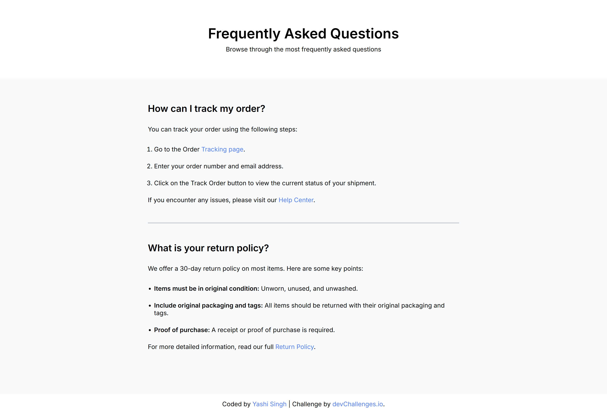
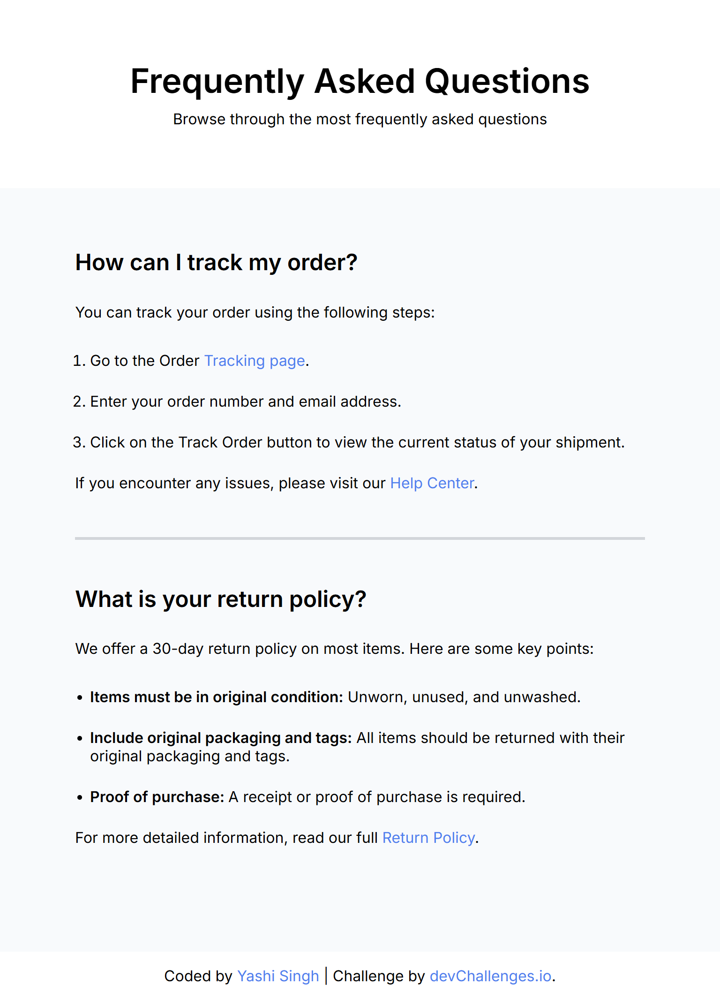
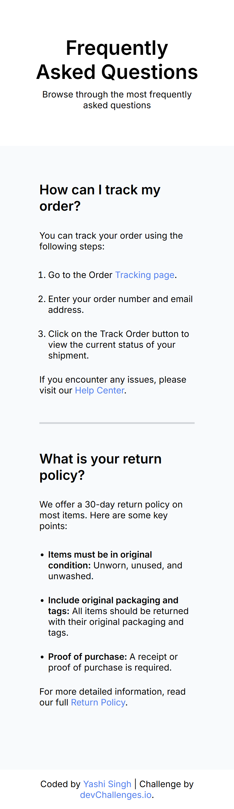

<h1 align="center">Simple FAQ Page | devChallenges</h1>

<div align="center">
   Solution for a challenge <a href="https://devchallenges.io/challenge/simple-faq-challenge" target="_blank">Simple FAQ</a> from <a href="https://devchallenges.io" target="_blank">devChallenges.io</a>.
</div>

<div align="center">
  <h3>
    <a href="https://yashi-singh-9.github.io/Simple-FAQ/">
      Demo
    </a>
    <span> | </span>
    <a href="https://devchallenges.io/solution/50694">
      Solution
    </a>
    <span> | </span>
    <a href="https://devchallenges.io/challenge/simple-faq-challenge">
      Challenge
    </a>
  </h3>
</div>

<!-- TABLE OF CONTENTS -->

## Table of Contents

* [Overview](#overview)

  * [What I Learned](#what-i-learned)
  * [Useful Resources](#useful-resources)
* [Built With](#built-with)
* [Features](#features)
* [Contact](#contact)
* [Acknowledgements](#acknowledgements)

---

## Overview

**Desktop Desing**


**Tablet Design**  


**Mobile Design**  


This is a responsive FAQ (Frequently Asked Questions) page built as part of the **Simple FAQ Page Challenge** from [devChallenges.io](https://devchallenges.io/). The page answers customer service questions like tracking orders and return policies. It demonstrates semantic HTML structure and clean, maintainable CSS.

### What I Learned

* How to structure semantic HTML for accessibility and SEO.
* Use of `:root` and CSS variables for consistent styling.
* Creating responsive, mobile-friendly layouts using relative units and Flexbox.
* Improved understanding of how to break content into reusable components.

```css
:root {
  --blue: #4E80EE;
  --dark-blue: #030616;
  --gray: #D2D5DA;
  --mist: #F8FAFC;
  --white: #FFFFFF;
}
```

### Useful Resources

* [MDN Web Docs](https://developer.mozilla.org/) – for deep dives into semantic tags and responsive layout techniques.
* [Google Fonts](https://fonts.google.com/) – used to import and apply the `Inter` font for modern typography.

---

## Built With

* Semantic HTML5
* CSS3
* CSS Variables
* Flexbox
* Mobile-first responsive design
* [Inter Font](https://fonts.google.com/specimen/Inter)

---

## Features

* Clean, accessible HTML structure.
* Styled FAQ sections using ordered and unordered lists.
* Interactive anchor links for navigation.
* Responsive layout for desktop and mobile.
* SEO-optimized meta tags for social media sharing (Open Graph + Twitter cards).

---

## Contact

**LinkedIn** : [Yashi Singh](https://www.linkedin.com/in/yashi-singh-b4143a246)

---

## Acknowledgements

* Challenge by [devChallenges.io](https://devchallenges.io/)
* Design inspiration and layout provided by the challenge editor.
* Special thanks to the open-source community for great documentation and support!
